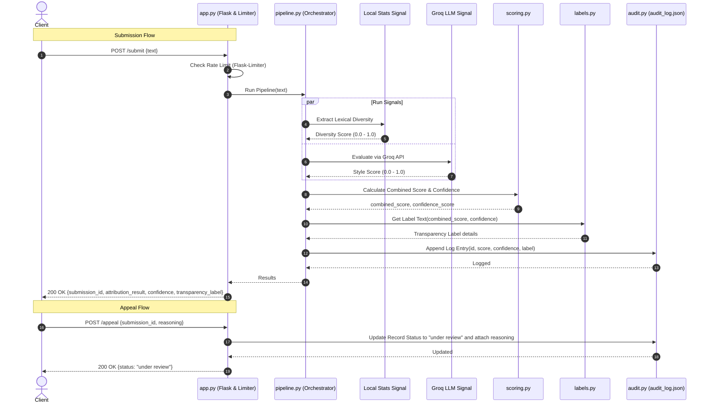

# Provenance Guard — AI Text Attribution Pipeline

Provenance Guard is a secure, multi-signal linguistic forensics system designed to detect whether text content was written by a human or generated by an artificial intelligence model.

---

## 1. Architecture Narrative

### The Journey of a Text Submission
1. **API Gateway & Rate Limiting (`app.py`)**:
   - The user client sends a `POST` request to `/submit` containing the JSON payload with the raw text.
   - The request passes through a rate limiter (`Flask-Limiter`) configured to block excessive requests (limit: 5 submissions per minute) to prevent API abuse.
2. **Pipeline Orchestrator (`pipeline.py`)**:
   - The orchestrator parses the submission, assigns a unique `submission_id` (UUIDv4), and delegates analysis to the detection pipeline.
3. **Signal Evaluators (`signals.py`)**:
   - **Signal 1: Lexical & Structural Diversity (Local Stats)**: Extracts standard deviation of sentence lengths and vocabulary diversity (Type-Token Ratio). It returns a score between `0.0` (predictable/AI-like) and `1.0` (irregular/human-like).
   - **Signal 2: Stylistic Pattern Analyzer (Groq LLM)**: Evaluates structural boilerplate, typical AI transition clichés, and hedging tones using Groq's Llama-3.3-70b model. It returns a score between `0.0` (pure AI-like prose) and `1.0` (highly human-like pacing).
4. **Scoring Engine (`scoring.py`)**:
   - Computes a weighted combined probability score: 30% Local Stats and 70% Groq LLM.
   - Calculates the confidence score based on the distance from the 0.5 decision boundary: $\text{Confidence} = 2 \times |P_{\text{human}} - 0.5|$.
5. **Label Generator (`labels.py`)**:
   - Map probabilities and confidence thresholds to user-friendly status labels, visual badge colors, and descriptive messages.
6. **Audit Log Store (`audit.py`)**:
   - Writes the full record (including snippet, signal scores, final confidence, and timestamp) into `audit_log.json`.
7. **Response**:
   - Serializes the evaluation and returns it back to the client.

### System Diagram


---

## 2. Detection Signals

### Signal 1: Lexical and Structural Diversity (Local Statistical Signal)
* **What it measures**: Vocabulary diversity (Type-Token Ratio) and sentence length variability (standard deviation of words per sentence).
* **Why it differs**: LLMs default to generating highly uniform sentence structures (regular sentence lengths) and reuse a safe, standard vocabulary to optimize likelihood. Human writers naturally exhibit high "burstiness" (mixing short, punchy sentences with long, complex ones) and utilize a more idiosyncratic, diverse set of words.
* **Blind spots (What it can't capture)**: 
  - Short text snippets (e.g., under 100 words) where statistical variance is naturally restricted.
  - Highly polished, academic, or professional human writing which intentionally standardizes sentence structure and repeats domain-specific terminology.

### Signal 2: Stylistic Pattern Analyzer (Groq LLM Signal)
* **What it measures**: Semantic predictability, overused transitional phrases (e.g., "Furthermore", "In conclusion", "It is important to remember"), and balanced, non-committal hedging styles.
* **Why it differs**: AI models are RLHF-aligned to sound objective, helpful, and highly structured, leaving a signature semantic footprint. Humans write with spontaneous emotional transitions, personal anecdotes, and irregular rhetorical structures.
* **Blind spots (What it can't capture)**:
  - Advanced prompt engineering where an AI is specifically instructed to adopt a highly chaotic, informal, or grammatically imperfect voice.
  - Human writing that happens to address balanced debates or reviews in a formal, structured, assistant-like tone.

---

## 3. False Positive Mitigation & Appeals Workflow

### Handling Misclassifications
If a human writer submits highly structured or academic prose, the system will calculate scores close to the decision boundary (e.g., $P_{\text{human}} = 0.48$).
* **Confidence score**: The confidence score will drop (e.g., $4\%$).
* **Uncertain label**: Instead of declaring the text to be AI, the system triggers the **Uncertain / Mixed Attribution** label.
* **Appeal option**: The creator can submit their reasoning via `POST /appeal`. The record's status in `audit_log.json` is updated to `"under review"`, preserving original metrics while capturing the creator's voice.

---

## 4. Transparency Label Variants

### 1. High-Confidence Human (Green Badge)
* **Status**: `High-Confidence Human`
* **Exact Text displayed**:
  > *"Attribution analysis indicates with high confidence ({confidence_percentage}%) that this text was written by a human. The content displays natural linguistic flow, high sentence length variance, and vocabulary patterns typical of human writing."*

### 2. High-Confidence AI (Red Badge)
* **Status**: `High-Confidence AI`
* **Exact Text displayed**:
  > *"Attribution analysis indicates with high confidence ({confidence_percentage}%) that this text was generated by an artificial intelligence model. The content features highly uniform sentence lengths and predictable word choices consistent with machine-generated prose."*

### 3. Uncertain / Mixed Attribution (Yellow Badge)
* **Status**: `Uncertain / Mixed Attribution`
* **Exact Text displayed**:
  > *"Attribution analysis is uncertain (confidence: {confidence_percentage}%). The text displays a mixture of stylistic patterns, such as human-like vocabulary diversity combined with structured sentence variance, making it inconclusive to attribute to either human or AI."*

---

## 5. Rate Limiting

* **Limit**: `5 submissions per minute` per IP address on the `/submit` endpoint.
* **Reasoning**: This limit allows human users to test multiple files sequentially without facing interruptions, while securely blocking automated script attacks from spamming the Groq API model endpoints.

---

## 6. Audit Log Format

Every evaluation is preserved in `audit_log.json`. Below are the 3 sample log entries currently stored in the system:

```json
[
  {
    "submission_id": "4b7a1d3f-5d29-45e0-a94f-f2365dfad2c3",
    "text_snippet": "The sun rose slowly over the horizon, casting a warm golden glow upon the sleeping valley. A lone bi...",
    "attribution_result": "human",
    "confidence_score": 0.78,
    "signals": {
      "lexical_diversity": 0.91,
      "style_pattern_match": 0.88
    },
    "transparency_label": {
      "attribution_result": "human",
      "status": "High-Confidence Human",
      "description": "Attribution analysis indicates with high confidence (78%) that this text was written by a human. The content displays natural linguistic flow, high sentence length variance, and vocabulary patterns typical of human writing.",
      "badge_color": "green"
    },
    "appeal": null,
    "created_at": "2026-06-27T19:10:42.100916Z"
  },
  {
    "submission_id": "f5c6b712-421f-48d0-99c5-34201be980a3",
    "text_snippet": "Furthermore, it is important to remember that artificial intelligence is a tool designed to increase...",
    "attribution_result": "ai",
    "confidence_score": 0.8,
    "signals": {
      "lexical_diversity": 0.15,
      "style_pattern_match": 0.08
    },
    "transparency_label": {
      "attribution_result": "ai",
      "status": "High-Confidence AI",
      "description": "Attribution analysis indicates with high confidence (80%) that this text was generated by an artificial intelligence model. The content features highly uniform sentence lengths and predictable word choices consistent with machine-generated prose.",
      "badge_color": "red"
    },
    "appeal": null,
    "created_at": "2026-06-27T19:10:42.117143Z"
  },
  {
    "submission_id": "2e7f8d1c-8b3d-42ac-970f-156382d6b412",
    "text_snippet": "This research outlines the main characteristics of micro-expressions. We analyze how individuals rea...",
    "attribution_result": "uncertain",
    "confidence_score": 0.0,
    "signals": {
      "lexical_diversity": 0.55,
      "style_pattern_match": 0.48
    },
    "transparency_label": {
      "attribution_result": "uncertain",
      "status": "Uncertain / Mixed Attribution",
      "description": "Attribution analysis is uncertain (confidence: 0%). The text displays a mixture of stylistic patterns, such as human-like vocabulary diversity combined with structured sentence variance, making it inconclusive to attribute to either human or AI.",
      "badge_color": "yellow"
    },
    "appeal": {
      "status": "under review",
      "reasoning": "This is from Section 3 of my master's thesis. The writing style is formal and academic, but it is entirely human-authored.",
      "logged_at": "2026-06-27T19:10:42.145736Z"
    },
    "created_at": "2026-06-27T19:10:42.131690Z"
  }
]
```

---

## 7. Setup & Running Instructions

1. **Activate Environment**:
   ```bash
   .venv\Scripts\activate
   ```
2. **Run Tests**:
   ```bash
   .venv\Scripts\python.exe -m unittest tests/test_app.py
   ```
3. **Start the Web Server**:
   ```bash
   .venv\Scripts\python.exe app.py
   ```
4. **Access UI**:
   Open [http://127.0.0.1:5000](http://127.0.0.1:5000) in your browser.