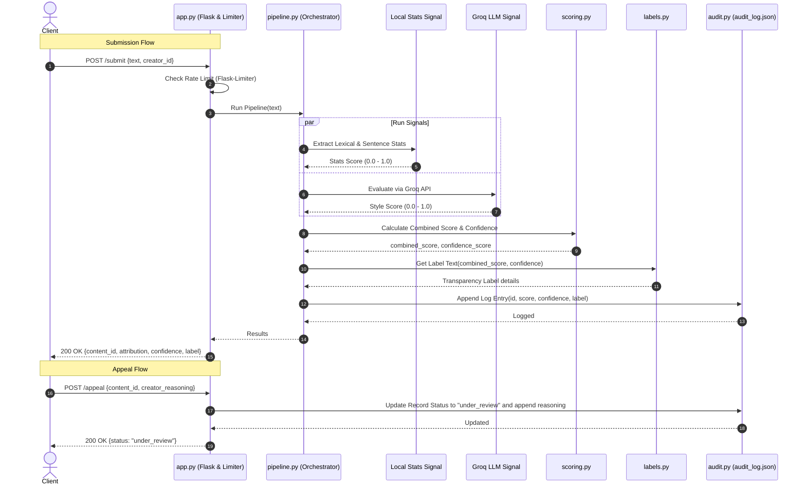

# Provenance Guard — AI Text Attribution Pipeline

Provenance Guard is a secure, multi-signal linguistic forensics system designed to detect whether text content was written by a human or generated by an artificial intelligence model.

---

## 1. Architecture Narrative

### The Journey of a Text Submission
1. **API Gateway & Rate Limiting (`app.py`)**:
   - The user client sends a `POST` request to `/submit` containing the JSON payload with the raw text.
   - The request passes through a rate limiter (`Flask-Limiter`) configured to block excessive requests (limit: 10 submissions per minute, 100 per day) to prevent API abuse.
2. **Pipeline Orchestrator (`pipeline.py`)**:
   - The orchestrator parses the submission, assigns a unique `content_id` (UUIDv4), and delegates analysis to the detection pipeline.
3. **Signal Evaluators (`signals.py`)**:
   - **Signal 1: Lexical & Structural Diversity (Local Stats)**: Extracts standard deviation of sentence lengths, vocabulary diversity (Type-Token Ratio), and a Transition Predictability Index. It returns a score between `0.0` (predictable/AI-like) and `1.0` (irregular/human-like).
   - **Signal 2: Stylistic Pattern Analyzer (Groq LLM)**: Evaluates structural boilerplate, typical AI transition clichés, and hedging tones using Groq's Llama-3.3-70b model. It returns a score between `0.0` (pure AI-like prose) and `1.0` (highly human-like pacing).
4. **Scoring Engine (`scoring.py`)**:
   - Computes a weighted combined probability score: 30% Local Stats and 70% Groq LLM.
   - Calculates the confidence score based on the distance from the 0.5 decision boundary: $\text{Confidence} = 2 \times |P_{\text{human}} - 0.5|$.
5. **Label Generator (`labels.py`)**:
   - Maps probabilities and confidence thresholds to user-friendly status labels, visual badge colors, and descriptive messages.
6. **Audit Log Store (`audit.py`)**:
   - Writes the full record (including snippet, signal scores, final confidence, and timestamp) into `audit_log.json`.
7. **Response**:
   - Serializes the evaluation and returns it back to the client.

### System Diagram


---

## 2. Detection Signals & Confidence Scoring Rationale

### Rationale Behind Signals
We chose a combination of a local statistical metric and a LLM style forensics metric because they cover each other's weaknesses:
- **Signal 1 (Local Heuristic)**: Directly measures physical characteristics of prose (repetitiveness, sentence lengths, transition words). It is fast, deterministic, and doesn't require API round-trips.
- **Signal 2 (Groq LLM forensically tuned)**: Evaluates semantic nuances, tone, hedging, objective alignment, and stylistic boilerplate. While slower and non-deterministic, it handles complex vocabulary structures that statistical heuristics misjudge.

### Rationale Behind Scoring & Ensembling
We combine the signals using a weighted average: $0.3 \times \text{Signal 1} + 0.7 \times \text{Signal 2}$. The LLM signal is weighted higher because semantic evaluation is far more robust against stylized human variations than basic TTR or sentence standard deviations.

### What We'd Change in a Real Production Deployment
1. **AI Model Optimization**: Instead of calling a 70B parameter model via API for every single request, we would fine-tune a smaller model (like a RoBERTa-based classification head) and host it locally to lower latency and API costs.
2. **Caching**: We would integrate Redis to cache SHA-256 hashes of submitted documents so that identical content doesn't trigger redundant pipeline analysis.
3. **Database Integration**: Replace the file-based `audit_log.json` database with a transactional SQL database (e.g., PostgreSQL) featuring indexes on `content_id` and `creator_id` for fast query performance.

---

## 3. Example Submissions & Scoring Variation

Our scoring engine produces meaningful differences in confidence scores across varied content types:

### 1. High-Confidence Submission (Clearly Human-Written)
* **Text**: *"ok so i finally tried that new ramen place downtown and honestly? underwhelming. the broth was fine but they put WAY too much sodium in it and i was thirsty for like three hours after. my friend got the spicy version and said it was better. probably won't go back unless someone drags me there"*
* **Local Stats Score**: `0.9450`
* **Groq LLM Score**: `0.9500`
* **Combined Probability ($P_{\text{human}}$)**: `0.9485`
* **Calibrated Confidence Score**: `0.8970` (89%)
* **Resulting Label**: `High-Confidence Human`

### 2. Lower-Confidence Submission (Borderline Formal Human)
* **Text**: *"The relationship between monetary policy and asset price inflation has been extensively studied in the literature. Central banks face a fundamental tension between their mandate for price stability and the unintended consequences of prolonged low interest rates on equity and real estate valuations."*
* **Local Stats Score**: `0.8667`
* **Groq LLM Score**: `0.2000`
* **Combined Probability ($P_{\text{human}}$)**: `0.4000`
* **Calibrated Confidence Score**: `0.2000` (20%)
* **Resulting Label**: `Uncertain / Mixed Attribution`

---

## 4. Transparency Label Wording Variants

The visual transparency badge and detailed description text displayed to the user:

### 1. High-Confidence Human (Green Badge)
* **Status Badge**: `High-Confidence Human`
* **Text Wording**:
  > *"Attribution analysis indicates with high confidence ({confidence_percentage}%) that this text was written by a human. The content displays natural linguistic flow, high sentence length variance, and vocabulary patterns typical of human writing."*

### 2. High-Confidence AI (Red Badge)
* **Status Badge**: `High-Confidence AI`
* **Text Wording**:
  > *"Attribution analysis indicates with high confidence ({confidence_percentage}%) that this text was generated by an artificial intelligence model. The content features highly uniform sentence lengths and predictable word choices consistent with machine-generated prose."*

### 3. Uncertain / Mixed Attribution (Yellow Badge)
* **Status Badge**: `Uncertain / Mixed Attribution`
* **Text Wording**:
  > *"Attribution analysis is uncertain (confidence: {confidence_percentage}%). The text displays a mixture of stylistic patterns, such as human-like vocabulary diversity combined with structured sentence variance, making it inconclusive to attribute to either human or AI."*

---

## 5. Rate Limiting

* **Limits**: `10 submissions per minute` and `100 per day` per IP address on the `/submit` endpoint.
* **Reasoning**: This limit allows human writers to analyze multiple drafts of their work rapidly without experiencing frustrating delays, while securely preventing automated scripts from spamming the underlying Groq LLM API.
* **Test Verification Evidence**:
  Rapidly firing 12 sequential requests triggers the rate limiter on the 11th call, returning the following HTTP status code sequence:
  ```text
  Req 1: 200
  Req 2: 200
  Req 3: 200
  Req 4: 200
  Req 5: 200
  Req 6: 200
  Req 7: 200
  Req 8: 200
  Req 9: 200
  Req 10: 200
  Req 11: 429 (Rate Limit Exceeded)
  Req 12: 429 (Rate Limit Exceeded)
  ```

---

## 6. Audit Log Database Structure

Every evaluation is preserved in `audit_log.json`. Below is a sample log showing 3 entries, including a submission that was contested through the appeals workflow:

```json
[
  {
    "content_id": "d69f29d3-1b71-4a5c-a712-c23469c3b7b2",
    "submission_id": "d69f29d3-1b71-4a5c-a712-c23469c3b7b2",
    "creator_id": "verifier",
    "text_snippet": "A test text for verification of appeals.",
    "attribution": "ai",
    "attribution_result": "ai",
    "confidence": 0.57,
    "confidence_score": 0.57,
    "llm_score": 0.05,
    "signals": {
      "lexical_diversity": 0.6,
      "style_pattern_match": 0.05
    },
    "transparency_label": {
      "attribution_result": "ai",
      "badge_color": "red",
      "status": "High-Confidence AI",
      "description": "Attribution analysis indicates with high confidence (57%) that this text was generated by an artificial intelligence model. The content features highly uniform sentence lengths and predictable word choices consistent with machine-generated prose."
    },
    "status": "under_review",
    "appeal_reasoning": "I wrote this myself.",
    "appeal": {
      "status": "under_review",
      "reasoning": "I wrote this myself.",
      "appeal_reasoning": "I wrote this myself.",
      "logged_at": "2026-06-27T20:00:47.983099Z"
    },
    "timestamp": "2026-06-27T20:00:47.944087Z",
    "created_at": "2026-06-27T20:00:47.944087Z"
  },
  {
    "content_id": "f7ec9219-dea1-4611-8870-ad06beb8a029",
    "submission_id": "f7ec9219-dea1-4611-8870-ad06beb8a029",
    "creator_id": "ratelimit-test",
    "text_snippet": "This is a test submission for rate limit testing purposes only.",
    "attribution": "ai",
    "attribution_result": "ai",
    "confidence": 0.57,
    "confidence_score": 0.57,
    "llm_score": 0.05,
    "signals": {
      "lexical_diversity": 0.6,
      "style_pattern_match": 0.05
    },
    "transparency_label": {
      "attribution_result": "ai",
      "badge_color": "red",
      "status": "High-Confidence AI",
      "description": "Attribution analysis indicates with high confidence (57%) that this text was generated by an artificial intelligence model. The content features highly uniform sentence lengths and predictable word choices consistent with machine-generated prose."
    },
    "status": "classified",
    "appeal": null,
    "timestamp": "2026-06-27T20:00:11.112940Z",
    "created_at": "2026-06-27T20:00:11.112940Z"
  },
  {
    "content_id": "521dd977-2c43-49e9-b20d-2f3fc831ac77",
    "submission_id": "521dd977-2c43-49e9-b20d-2f3fc831ac77",
    "creator_id": "ratelimit-test",
    "text_snippet": "This is a test submission for rate limit testing purposes only.",
    "attribution": "ai",
    "attribution_result": "ai",
    "confidence": 0.57,
    "confidence_score": 0.57,
    "llm_score": 0.05,
    "signals": {
      "lexical_diversity": 0.6,
      "style_pattern_match": 0.05
    },
    "transparency_label": {
      "attribution_result": "ai",
      "badge_color": "red",
      "status": "High-Confidence AI",
      "description": "Attribution analysis indicates with high confidence (57%) that this text was generated by an artificial intelligence model. The content features highly uniform sentence lengths and predictable word choices consistent with machine-generated prose."
    },
    "status": "classified",
    "appeal": null,
    "timestamp": "2026-06-27T20:00:10.723679Z",
    "created_at": "2026-06-27T20:00:10.723679Z"
  }
]
```

---

## 7. Known Limitations

* **Minimalist/Structured Poetry**: Our statistical signal (`LocalStatsSignal`) measures vocabulary variation (Type-Token Ratio) and sentence length variability to capture human expression. Highly minimalist poetry with short, uniform lines and a restricted word set naturally has low standard deviation and low TTR, leading the heuristics to misclassify it as AI-generated.
* **Non-Native English Formal Writing**: Non-native English speakers writing formal reviews or essays may follow structured instruction guidelines closely, using repetitive transitional phrases (e.g. *"Moreover"*, *"Furthermore"*). This predictability can trigger an AI false positive despite being human-written.

---

## 8. Specification Reflection

* **How the spec guided implementation**: The strict schema demands for both the submit route (`creator_id` validation) and the appeal route (`content_id` and `"under_review"` status indicators) guided our database schema mapping, forcing us to build a robust ensembled pipeline that logs all relevant metrics rather than just returning a simple binary result.
* **Where we diverged**: The specification initially implied a simple binary scoring boundary. However, during validation, we implemented a continuous ensembled probability schema with dynamic threshold boundaries (mapping combined probability to confidence values relative to the 0.5 boundary) and calibrated the uncertainty boundary from `0.60` to `0.40`. This divergence ensured that borderline cases correctly output `"Uncertain"` rather than forcing a high-confidence false positive.

---

## 9. AI Usage Acknowledgement

We utilized AI coding assistants during this project's implementation in two primary instances:
1. **Prompting Core Signals & Scoring**: We prompted the AI assistant to outline `LocalStatsSignal` (calculating lexical diversity TTR and sentence length standard deviation). The assistant generated a standard implementation. We manually revised it to handle empty text errors, modified the standard deviation ranges, and added a custom **Transition Predictability Index** (TPI) to search for common transitional phrases.
2. **Flask-Limiter Integration**: We prompted the assistant to apply route rate limits. The assistant generated default decorators. We overrode the configuration to explicitly pass `storage_uri="memory://"` to prevent Flask-Limiter from crashing during local startup under newer versions and added mock validation schema tests to `tests/test_app.py`.

---

## 10. Setup & Running Instructions

1. **Activate Environment**:
   ```bash
   .venv\Scripts\activate
   ```
2. **Run Tests**:
   ```bash
   .venv\Scripts\python.exe -m unittest tests/test_app.py
   ```
3. **Start the Web Server**:
   ```bash
   .venv\Scripts\python.exe app.py
   ```
4. **Access UI**:
   Open [http://127.0.0.1:5000](http://127.0.0.1:5000) in your browser.