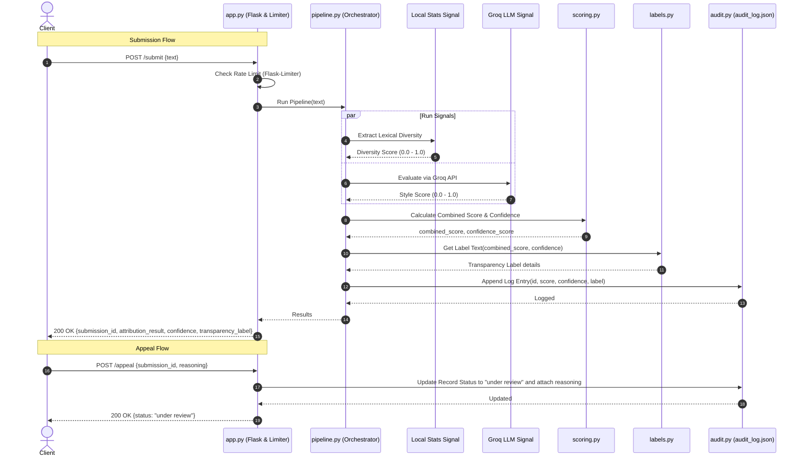

# Implementation Plan - Provenance Guard

## Goal Description
We are building a robust text provenance detection system called **Provenance Guard**. This system will analyze submitted text (e.g., poems, short stories, blogs) to determine whether it was written by a human or generated by an AI. It implements a multi-signal detection pipeline, confidence scoring, a structured audit log, an appeals workflow, and rate-limiting.

---

## 1. Architecture Narrative

### The Journey of a Text Submission
1. **API Gateway / Flask Routing (`app.py`)**:
   - The user client sends a `POST` request to `/submit` containing the raw JSON payload with the text.
   - The request is intercepted by the **Rate Limiter** (`Flask-Limiter`). If the client has exceeded the limit, the request is rejected with a `429 Too Many Requests` error.
   - If allowed, the router validates the payload structure (e.g., checks if `text` is present and not empty).
2. **Pipeline Orchestrator (`pipeline.py`)**:
   - The verified raw text is passed to the `DetectionPipeline`.
   - The pipeline instantiates and executes two independent **Feature extractors (Signals)**:
     - **Signal 1: Lexical and Structural Diversity Extractor**
     - **Signal 2: Stylistic Pattern Analyzer (via Groq API)**
3. **Signal Evaluators**:
   - **Signal 1 (Local)**: Computes the Type-Token Ratio (vocabulary richness) and standard deviation of sentence lengths. It returns a signal score between 0.0 (high AI probability) and 1.0 (high human probability).
   - **Signal 2 (Groq LLM)**: Sends a structured prompt to the Groq API (`llama-3.3-70b-versatile`) to evaluate linguistic predictability, cliché transition usage, and stylistic signature. It returns a score between 0.0 (high AI probability) and 1.0 (high human probability).
4. **Scoring Engine (`scoring.py`)**:
   - Receives the raw scores from both signals.
   - Applies a weighted ensemble formula to compute the **Combined Probability Score** ($P_{\text{human}}$).
   - Computes the **Confidence Score** as the distance from the midpoint (0.5), mapped to a $0.0 - 1.0$ scale.
5. **Label Generator (`labels.py`)**:
   - Evaluates the final classification (AI, Human, or Uncertain) based on the combined score and confidence thresholds.
   - Generates the appropriate **Transparency Label** (exact status text, description, and badge category) customized to the calculated confidence level.
6. **Audit Log Store (`audit.py`)**:
   - Records a structured entry containing the submission ID, raw text snippet, individual signal scores, final combined score, confidence, label, and timestamp into a persistent JSON-based audit log (`audit_log.json`).
7. **Response Serialization**:
   - Returns a structured `200 OK` JSON response to the user containing the attribution result, confidence score, transparency label, and submission ID.

---

## 2. Detection Signals

### Signal 1: Lexical and Structural Diversity (Local Statistical Signal)
* **What it measures**: The combination of vocabulary diversity (Type-Token Ratio) and sentence length variability (standard deviation of words per sentence).
* **Why it differs**: LLMs default to generating highly uniform sentence structures (regular sentence lengths) and reuse a safe, standard vocabulary to optimize likelihood. Human writers naturally exhibit high "burstiness" (mixing short, punchy sentences with long, complex ones) and utilize a more idiosyncratic, diverse set of words.
* **Blind spots (What it can't capture)**: 
  - Short text snippets (e.g., under 100 words) where statistical variance is naturally restricted.
  - Highly polished, academic, or professional human writing which intentionally standardizes sentence structure and repeats domain-specific terminology.

### Signal 2: Stylistic Pattern Analyzer (Groq LLM Signal)
* **What it measures**: Semantic predictability, overused transitional phrases (e.g., "Furthermore", "In conclusion", "It is important to remember"), and balanced, non-committal hedging styles.
* **Why it differs**: AI models are RLHF-aligned to sound objective, helpful, and highly structured, leaving a signature semantic footprint. Humans write with spontaneous emotional transitions, personal anecdotes, and irregular rhetorical structures.
* **Blind spots (What it can't capture)**:
  - Advanced prompt engineering where an AI is specifically instructed to adopt a highly chaotic, informal, or grammatically imperfect voice.
  - Human writing that happens to address balanced debates or reviews in a formal, structured, assistant-like tone.

---

## 3. The False Positive Scenario (Human Misclassified as AI)

If a human writer submits a highly structured piece of text (e.g., a formal essay or technical documentation) and the system misclassifies it:
1. **Confidence Score Reflection**: The system will produce signal scores close to the decision boundary (e.g., Combined $P_{\text{human}} = 0.45$). This maps to a low confidence (e.g., $10\%$ confidence).
2. **Label Output**: Rather than accusing the creator with high confidence, the system renders the **Uncertain / Mixed Attribution** label. The text will state: *"Attribution analysis is uncertain. The writing exhibits a mixture of highly structured patterns and human-like phrasing."*
3. **Creator Appeal**:
   - The creator can click "Appeal" on the interface or send a `POST /appeal` request specifying their `submission_id` and their reasoning (e.g., *"This is my academic paper, I write formally"*).
   - The system intercepts the appeal, logs the appeal reason directly inside the structured audit record for that submission, and flags the submission status as `"under review"`.

---

## 4. API Surface Sketch

### 1. `POST /submit`
* **Accepts**:
  ```json
  {
    "text": "The quick brown fox jumps over the lazy dog..."
  }
  ```
* **Returns**:
  ```json
  {
    "submission_id": "uuid-v4-string",
    "attribution_result": "human" | "ai" | "uncertain",
    "confidence_score": 0.88,
    "signals": {
      "lexical_diversity": 0.85,
      "style_pattern_match": 0.90
    },
    "transparency_label": {
      "status": "High-Confidence Human",
      "description": "Attribution analysis shows a high level of confidence (88%) that this text was written by a human. The writing displays natural linguistic diversity and irregular sentence structures.",
      "badge_color": "green"
    },
    "created_at": "2026-06-27T19:08:44Z"
  }
  ```

### 2. `POST /appeal`
* **Accepts**:
  ```json
  {
    "submission_id": "uuid-v4-string",
    "reasoning": "This is my personal journal entry."
  }
  ```
* **Returns**:
  ```json
  {
    "appeal_id": "uuid-v4-string",
    "submission_id": "uuid-v4-string",
    "status": "under review",
    "reasoning": "This is my personal journal entry.",
    "logged_at": "2026-06-27T19:10:12Z"
  }
  ```

### 3. `GET /log`
* **Accepts**: None (Optional query param `?limit=10`)
* **Returns**:
  ```json
  [
    {
      "submission_id": "uuid-v4-string",
      "text_snippet": "The quick brown...",
      "attribution_result": "human",
      "confidence_score": 0.88,
      "signals": {
        "lexical_diversity": 0.85,
        "style_pattern_match": 0.90
      },
      "appeal": {
        "status": "under review",
        "reasoning": "...",
        "logged_at": "..."
      },
      "created_at": "..."
    }
  ]
  ```

---

## 5. System Diagrams



---

## 6. Verification Plan

### Automated Tests
We will write python unit tests in a test suite using `unittest` or `pytest`.
- Run: `python -m unittest tests/test_app.py`
  - Verifies `/submit` returns correct structures and classification boundaries.
  - Verifies `/appeal` successfully modifies the audit log entry.
  - Verifies rate limiting blocks calls after limits are exceeded.

### Manual Verification
- Execute curl/Powershell commands to submit known AI text (e.g. standard ChatGPT output) and verify it gets flagged as AI.
- Submit a diverse text (e.g. poetry) and verify it gets classified as Human.
- Submit an appeal on a submission and fetch `/log` to confirm the status is updated to `"under review"`.
